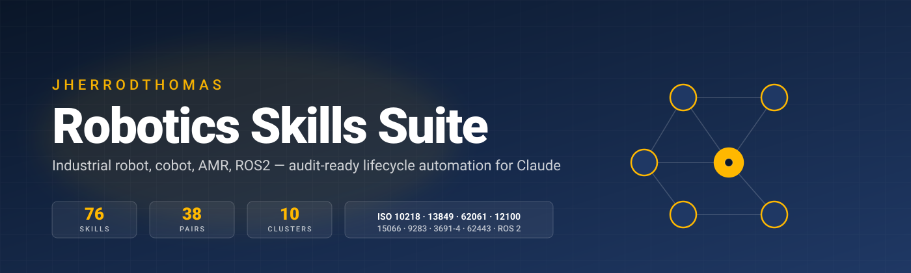
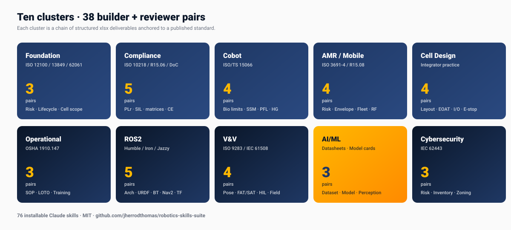
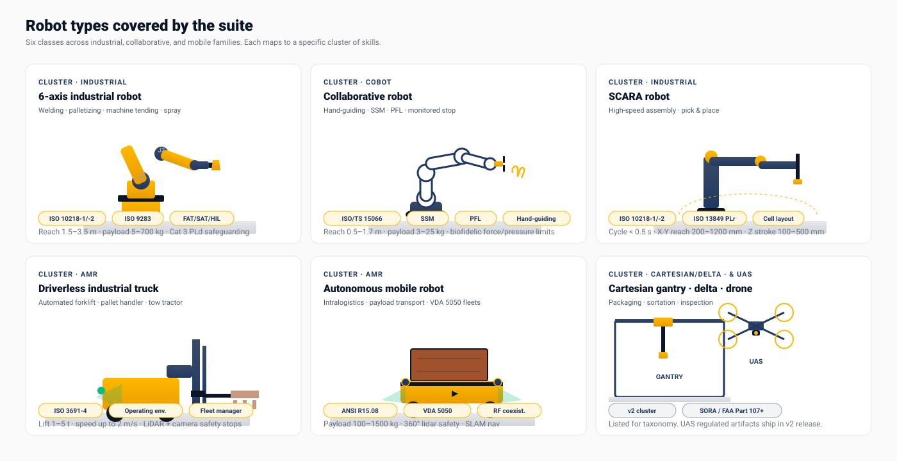
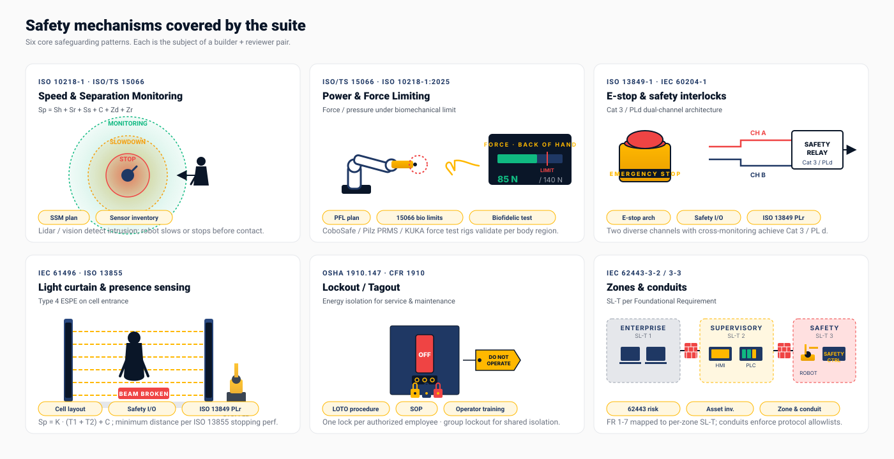
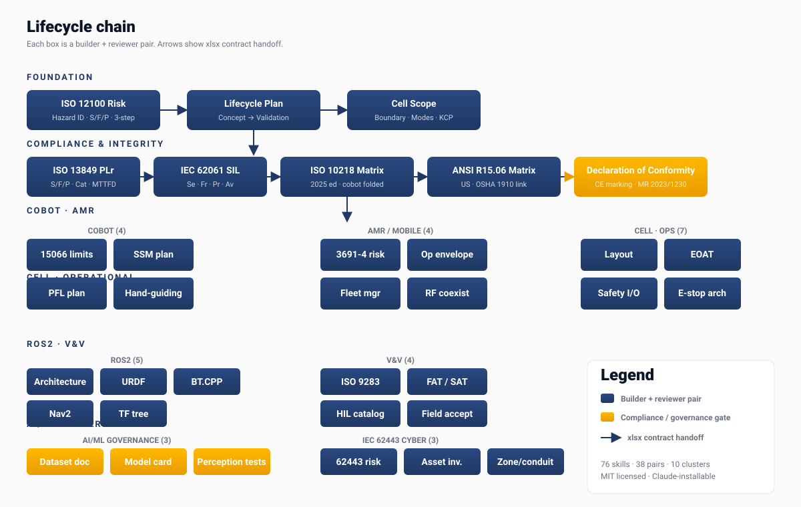

<div align="center">



[](LICENSE)
[](skills/)
[]()
[]()
[](https://claude.com)

Every artifact-producing skill is paired with a confirmation reviewer. Reviewer outputs include a visual dashboard with KPI tiles, charts, and findings tables.

[About](#about) · [Quickstart](#quickstart) · [The Chain](#the-chain) · [Skills](#skills) · [Standards](#standards-covered) · [Why](#why)

</div>

---

## About

The Robotics Skills Suite is a curated set of 38 builder + 38 matching reviewer skills that automate every structured xlsx deliverable in the modern industrial-robotics lifecycle — from ISO 12100 risk assessment through ISO 13849-1 PLr / IEC 62061 SIL determination, ISO 10218-2:2025 / ANSI R15.06 compliance matrices, ISO/TS 15066 cobot biomechanics, ISO 3691-4 AMR risk, OSHA 1910.147 LOTO, ROS2 architecture artifacts, ISO 9283 performance verification, FAT/SAT acceptance protocols, AI/ML governance (datasheets, model cards), and IEC 62443 industrial cybersecurity.

Every builder produces a multi-tab audit-ready xlsx workbook. Every reviewer produces a confirmation-measures checklist over that workbook with a visual dashboard. Skills hand off via stable xlsx contracts — change a number in the upstream Risk Assessment and every downstream skill in the chain (PLr → Compliance Matrix → Declaration of Conformity) consumes the new value automatically.

This is the natural counterpart to the [automotive-skills-suite](https://github.com/jherrodthomas/automotive-skills-suite) (152 skills, ISO 26262 / ISO/SAE 21434 / IATF 16949 / ASPICE / AUTOSAR / V&V). Together they cover the two largest standards-driven engineering verticals.

### Who this is for

- **Robot integrators** producing ISO 10218-2 / ANSI R15.06 compliance documentation for every cell delivery
- **OEM machine builders** generating CE marking / ANSI safety files at scale
- **Cobot deployers** running ISO/TS 15066 biomechanical validation, SSM, and PFL plans
- **AMR / AGV operators** executing ISO 3691-4 risk assessments and fleet manager architectures
- **ROS2 development teams** producing system architecture, URDF, behavior tree, Nav2, and TF spec documents
- **OT cybersecurity teams** running IEC 62443-3-2 risk assessments and zone & conduit segmentation
- **AI/ML in robotics teams** producing datasheets for datasets, model cards, and perception test catalogs

<div align="center">

</div>

## Robot types covered

<div align="center">

</div>

The suite covers six classes of robots — 6-axis industrial arms, collaborative robots, SCARA, driverless industrial trucks, autonomous mobile robots, plus Cartesian gantries and a placeholder lane for UAS that ships in v2. Each class maps to a specific cluster of skills.

## Safety mechanisms covered

<div align="center">

</div>

The six core safeguarding patterns every integrator needs to document — Speed and Separation Monitoring, Power and Force Limiting, E-stop and dual-channel safety architecture, light curtains and presence sensing, lockout/tagout, and IEC 62443 zone & conduit segmentation. Each is the subject of a builder + reviewer pair (most have several).

---

## What this is

A curated set of 38 builder skills + 38 matching confirmation reviewer skills that automate the structured xlsx deliverables required across industrial robotics and AMR engineering:

- **Machinery safety** (ISO 12100 risk → ISO 13849-1 PLr / IEC 62061 SIL → compliance matrix → DoC)
- **Industrial + collaborative robots** (ISO 10218-1/-2:2025, ISO/TS 15066 cobot biomechanics, SSM, PFL, hand-guiding)
- **Autonomous mobile robots** (ISO 3691-4, ANSI/RIA R15.08, fleet manager architecture, wireless coexistence)
- **Cell design** (cell layout, EOAT, safety I/O matrix, E-stop architecture)
- **Operations** (SOP, LOTO per OSHA 1910.147, operator training matrix)
- **ROS2 software architecture** (system architecture, URDF, behavior trees, Nav2, TF tree)
- **V&V** (ISO 9283 performance, FAT/SAT acceptance, HIL test catalog, field acceptance)
- **AI/ML governance** (datasheets for datasets, model cards, perception test catalog)
- **Industrial cybersecurity** (IEC 62443 risk assessment, OT asset inventory, zone & conduit plan)

Each skill is an installable `.skill` file. Like the automotive suite, the chain is the moat — every downstream skill consumes the upstream skill's xlsx output as a stable file-format contract.

## Quickstart

1. Download a `.skill` file from `skills/` (or grab `robotics-skills-suite-bundle-76.zip` for all 76)
2. Click "Save skill" in Cowork / Claude Desktop to install
3. Trigger by phrasing — every skill declares its triggering description in its frontmatter

```
Example: install ISO 12100 risk assessment, then ask Claude
"Run an ISO 12100 risk assessment on a new cobot palletizing cell"
```

## The chain

<div align="center">

</div>

```
ISO 12100 Risk Assessment → Machinery Safety Lifecycle Plan → Robot Cell Scope
                                       ↓
                ISO 13849-1 PLr / IEC 62061 SIL determination
                                       ↓
                ISO 10218-1/2 (or ANSI R15.06) Compliance Matrix
                                       ↓
                              Declaration of Conformity (CE)

Cobot lane:
ISO/TS 15066 Biomechanical Limits → SSM Plan / PFL Plan / Hand-Guiding

AMR lane:
ISO 3691-4 Risk Assessment → Operating Envelope → Fleet Manager Architecture
                                                  → Wireless Coexistence Plan

Cell + Operational lane:
Cell Layout → EOAT Spec → Safety I/O Matrix → Interlock + E-Stop Architecture
                                                  → SOP → LOTO → Operator Training

ROS2 lane:
ROS2 System Architecture → URDF Spec → Behavior Tree Spec → Nav2 Config → TF Tree

V&V lane:
ISO 9283 Performance → Acceptance Protocol (FAT/SAT) → HIL Catalog → Field Acceptance

AI/ML governance:
Dataset Documentation → Model Card → Perception Test Catalog

Cybersecurity:
IEC 62443 Risk Assessment → OT Asset Inventory → Zone & Conduit Plan
```

Every box has a builder skill AND a matching reviewer skill.

## Skills

### Foundation (3 pairs)
| Skill | Standard |
|-------|----------|
| `iso12100-risk-assessment-builder` + reviewer | ISO 12100 |
| `machinery-safety-lifecycle-plan-builder` + reviewer | ISO 13849-1 / IEC 62061 |
| `robot-cell-scope-builder` + reviewer | ISO 10218-2, ANSI R15.06 |

### Compliance & Integrity (5 pairs)
| Skill | Standard |
|-------|----------|
| `iso13849-plr-builder` + reviewer | ISO 13849-1 |
| `iec62061-sil-builder` + reviewer | IEC 62061 |
| `iso10218-compliance-matrix-builder` + reviewer | ISO 10218-1/-2:2025 |
| `ansi-r1506-compliance-matrix-builder` + reviewer | ANSI/RIA R15.06-2012 R2017 |
| `declaration-of-conformity-builder` + reviewer | EU Machinery Reg 2023/1230 |

### Cobot (4 pairs)
| Skill | What it produces |
|-------|------------------|
| `iso15066-biomechanical-limits-builder` + reviewer | Per body region force/pressure limits with measured values |
| `ssm-plan-builder` + reviewer | Speed & Separation Monitoring with Sp formula |
| `pfl-plan-builder` + reviewer | Power & Force Limiting with biofidelic measurements |
| `cobot-hand-guiding-builder` + reviewer | Hand-guiding device + 3-position enabling switch design |

### AMR / Mobile (4 pairs)
| Skill | What it produces |
|-------|------------------|
| `iso3691-4-risk-assessment-builder` + reviewer | Driverless industrial truck risk assessment |
| `operating-envelope-builder` + reviewer | Hazard zone map (operational/restricted/no-go/charging) |
| `fleet-manager-architecture-builder` + reviewer | Multi-AMR coordination with VDA 5050 |
| `wireless-coexistence-plan-builder` + reviewer | Wi-Fi / UWB / 5G channel planning + EMC |

### Cell Design (4 pairs)
| Skill | What it produces |
|-------|------------------|
| `robot-cell-layout-builder` + reviewer | Cell footprint, fence, light curtain, work zones |
| `eoat-spec-builder` + reviewer | End-of-arm tooling spec |
| `safety-io-matrix-builder` + reviewer | F-DI / F-DO matrix with category + response time |
| `interlock-estop-architecture-builder` + reviewer | E-stop network with Cat B/1/2/3/4 ratings |

### Operational (3 pairs)
| Skill | What it produces |
|-------|------------------|
| `robot-sop-builder` + reviewer | Pre-start, normal op, fault recovery, shutdown |
| `loto-procedure-builder` + reviewer | OSHA 1910.147 lockout/tagout |
| `operator-training-matrix-builder` + reviewer | Per-role qualification matrix |

### ROS2 (5 pairs)
| Skill | What it produces |
|-------|------------------|
| `ros2-system-architecture-builder` + reviewer | Node, topic, service, action, lifecycle, DDS QoS |
| `urdf-model-spec-builder` + reviewer | URDF/xacro kinematic + inertial spec |
| `behavior-tree-spec-builder` + reviewer | BehaviorTree.CPP node + blackboard spec |
| `nav2-config-builder` + reviewer | Nav2 costmap + planner + recovery config |
| `tf-tree-spec-builder` + reviewer | TF tree per REP 105 / REP 103 |

### V&V (4 pairs)
| Skill | What it produces |
|-------|------------------|
| `iso9283-performance-test-builder` + reviewer | Pose accuracy, repeatability, path velocity |
| `robot-acceptance-protocol-builder` + reviewer | FAT + SAT protocol with customer signoff |
| `robot-hil-test-catalog-builder` + reviewer | Sensor fault, comm loss, power fault, E-stop tests |
| `robot-field-acceptance-builder` + reviewer | OEE-based on-site acceptance with handover |

### AI / ML Governance (3 pairs)
| Skill | What it produces |
|-------|------------------|
| `dataset-documentation-builder` + reviewer | Datasheets for Datasets (Gebru et al.) |
| `model-card-builder` + reviewer | Mitchell et al. model cards with per-slice fairness |
| `perception-test-catalog-builder` + reviewer | Edge cases + adversarial + FP/FN scenarios |

### Industrial Cybersecurity (3 pairs)
| Skill | What it produces |
|-------|------------------|
| `iec62443-risk-assessment-builder` + reviewer | IEC 62443-3-2 risk with SL-T per FR1-FR7 |
| `ot-asset-inventory-builder` + reviewer | IACS asset register with firmware + patch status |
| `zone-conduit-plan-builder` + reviewer | Zone segmentation + conduit protocol allowlists |

## Standards covered

ISO 12100:2010 · ISO 13849-1:2023 · IEC 62061:2021 · ISO 10218-1/-2:2025 · ISO/TS 15066:2016 · ISO 3691-4:2020 · ANSI/RIA R15.06-2012 R2017 · ANSI/RIA R15.08-1/-2/-3 · ISO 9283:1998 · OSHA 1910.147 · OSHA 1910.212 · EU Machinery Directive 2006/42/EC · EU Machinery Regulation 2023/1230 · IEC 62443 series · IEC 61508 · REP 105 / REP 103 · ROS 2 Humble / Iron / Jazzy · Mitchell et al. Model Cards · Gebru et al. Datasheets for Datasets · ISO/IEC 5469 (AI in safety systems) · VDA 5050

## Why

Every robot integration project ships an avalanche of structured deliverables — most teams maintain them in xlsx, painstakingly hand-edited, with low audit-trail consistency. This suite turns each phase into a builder + reviewer pair where:

- The **builder** produces the structured xlsx output from a JSON input plus the upstream artifact
- The **reviewer** runs a confirmation-measures checklist on the builder's output and produces a visual dashboard with KPIs, charts, and findings

The chain compounds because phases hand off via stable xlsx contracts. A change upstream (Risk Assessment) automatically propagates to every downstream skill that consumes it (PLr → Compliance Matrix → DoC).

## Common patterns across the suite

- All builder outputs use NAVY/Calibri styling with PLr/SIL color coding
- All reviewer outputs include visual dashboards (KPI tiles, pie chart, compliance bar, stacked rating breakdown by section, findings table)
- Reviewers never modify source artifacts — gaps land in Recommended Actions
- Every builder is paired with a reviewer for confirmation-measures compliance

## Repo structure

```
robotics-skills-suite/
├── skills/                              # 76 .skill bundles, install individually
├── examples/                            # One README per skill — input, output, sample I/O (76/76)
├── docs/
│   ├── AUTONOMOUS_LOG.md                # Daily maintenance journal
│   ├── weekly/                          # Weekly plans and targets
│   ├── monthly/                         # Monthly roll-ups
│   ├── skill-polish-log/                # Per-skill review findings
│   └── triage/                          # Issue triage records
├── scripts/
│   └── gen_status.py                    # Regenerates STATUS.md
├── assets/                              # Diagrams used by this README
├── robotics-skills-suite-bundle-76.zip  # All 76 skills in one download
├── STATUS.md                            # Pairing, domain and freshness per builder
├── CHANGELOG.md                         # Weekly change log
├── RELEASES.md                          # Tagged snapshot notes
├── ABOUT.md
├── README.md
└── LICENSE
```

## Companion suite

The [Automotive Skills Suite](https://github.com/jherrodthomas/automotive-skills-suite) covers ISO 26262, ISO/SAE 21434, ISO 21448, AIAG-VDA, ASPICE, AUTOSAR, diagnostics, calibration, MBSE, SysML, and V&V — 152 skills in the same builder + reviewer pattern.

## License

MIT — see LICENSE file.

---

<div align="center">

Built with Claude. Designed for robotics integrators, machine builders, and safety engineers shipping real cells.

</div>
